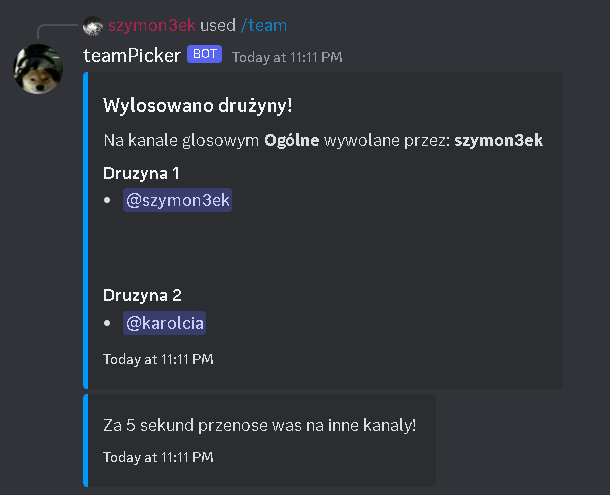

## Bot na discorda ktory sam tworzy druzyny!
# funckje:
  - automatyczne pobieranie danych ludzi na kanale głosowym i automatyczne losowanie drużyn
  - tworzenie kanału z określoną liczba osób (liczba osób / 2) oraz przeniesnie teamów na te kanały
  - automatycznie usuniecie kanału, jeżeli wszystkie osoby z niego wyjdą
# komendy:
  /team - tworzy team
# screen:
  
  
  
